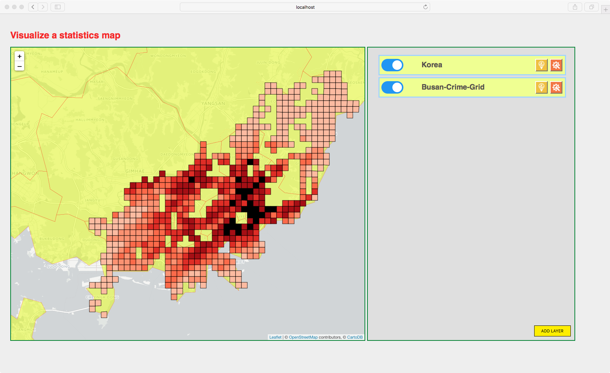

# geoStatViz-board

- 통계적 공간데이터를 시각화 하기 위한 플랫폼
- Front-end : angularjs-gulp-browserify-boilerplate
- Back-end : Node.js, GeoServer
- DB : MongoDB
- R package와 python 버전으로 분리하여 웹GIS에서 활용 가능한 통계 모듈을 구현할 예정입니다.
  * OLS
  * Interpolation
  * GWR 
  * Average Nearest Neighbor
  * High/Low Clustering(Getis-Ord G) 
  * Hot Spot Analysis(Getis-Ord Gi*)
  * Cluster and OutlinerAnalysis(Anselin Local Morans' I)
  * Spatial Autocorrelation(Morans’ I) 등을 구현할 얘정

